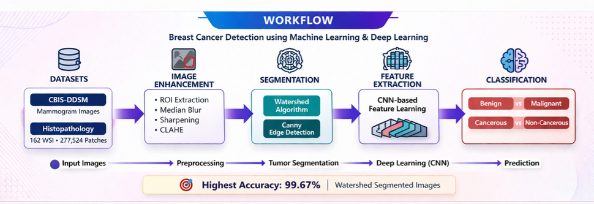
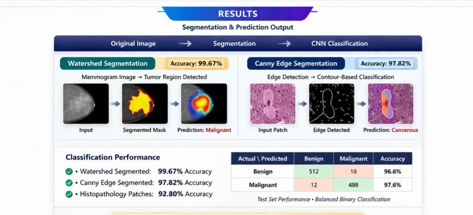

# 🩺 # 🩺 Breast Cancer Detection Using AI (CNN-Based Medical Imaging Pipeline)

AI-powered breast cancer detection system using image enhancement, segmentation (Watershed & Canny), and CNN-based classification achieving up to **99.67% accuracy**.

> This project presents an end-to-end deep learning pipeline for analyzing mammogram and histopathology images to detect cancerous patterns using computer vision and CNN models.

---

## 💡 Key Highlights

- End-to-end deep learning pipeline for medical image analysis  
- Image enhancement + segmentation + classification workflow  
- Achieved up to **99.67% accuracy** on segmented images  
- Modular and scalable code structure  
- Designed for real-world healthcare AI applications  

---

## 📁 Project Structure

```bash
src/                # Core ML pipeline (preprocessing, segmentation, training, prediction)
notebooks/          # Jupyter notebooks for experimentation and analysis
assets/images/      # Workflow diagrams and sample outputs
requirements.txt    # Project dependencies
README.md           # Project documentation
```

The project is structured to separate core ML logic, experimentation, and outputs for better scalability and maintainability.

---

## 🚀 Overview

This project applies computer vision and deep learning techniques to classify breast cancer images using:

- **CBIS-DDSM** mammogram dataset  
- **Breast Histopathology Images** dataset  

The pipeline includes preprocessing, segmentation, feature extraction, and CNN-based classification to improve cancer detection accuracy.

---

## ⚙️ Workflow

### 1️⃣ Image Enhancement
- ROI Extraction  
- Median Blur Filter  
- Sharpening Filter  
- CLAHE (Contrast Enhancement)  

### 2️⃣ Image Segmentation
- Watershed Algorithm  
- Canny Edge Detection  

### 3️⃣ Feature Extraction
- CNN layers extract important patterns from processed images  

### 4️⃣ Classification
- Benign vs. Malignant  
- Cancerous vs. Non-Cancerous  

---

## 📊 Results

- **99.67% accuracy** → Watershed segmented images  
- **97.82% accuracy** → Canny edge segmented images  
- **92.80% accuracy** → Histopathology classification  

---

## 📊 Sample Outputs

### Workflow


### Segmentation / Prediction Output


---

## 📂 Datasets Used

### 1. CBIS-DDSM
- Curated Breast Imaging Subset of DDSM  
- Approx. **5 GB dataset**  
- Used for enhancement, segmentation, and classification  

### 2. Breast Histopathology Images
- **162** whole-slide images  
- **277,524** image patches  
- **50x50 px resolution**  
- Used for cancerous vs. non-cancerous classification  

---

## 🛠️ Technologies Used

- Python  
- TensorFlow / Keras  
- OpenCV  
- CNN (Convolutional Neural Networks)  
- Pandas, NumPy  
- Matplotlib  
- Jupyter Notebook  

---

## ⚡ How to Run

```bash
pip install -r requirements.txt
python src/train.py
python src/predict.py
```

---

## 🔮 Future Improvements

- Deploy as a full-stack web application  
- Add real-time image upload and prediction  
- Improve dataset balancing and augmentation  
- Add model explainability (Grad-CAM, saliency maps)  
- Optimize model performance and inference speed  

---

## 👩‍💻 Author

**Archana Vellingiri Raja**  
Full-Stack Developer | AI/ML Engineer | Cloud Engineer  

- 🌐 Portfolio: https://archanav-portfolio.vercel.app/  
- 💼 LinkedIn: https://linkedin.com/in/archanav99  
- 📧 Email: archana999v@gmail.com  
